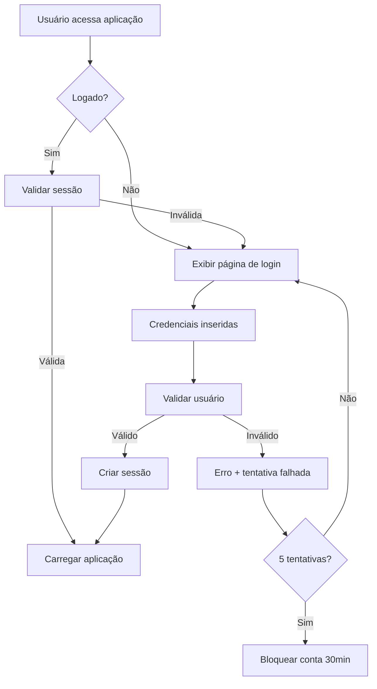

# 🔐 Implementação do Sistema de Segurança

## Resumo das Mudanças

Este documento descreve a implementação completa do sistema de autenticação e segurança adicionado à Locadora Strealit.

## 📁 Arquivos Criados/Modificados

### 🔧 Novos Arquivos
- `auth.py` - Módulo completo de autenticação
- `run_app.py` - Script auxiliar para execução

### 📝 Arquivos Modificados
- `app8.py` - Integração do sistema de login
- `requirements.txt` - Adição do bcrypt
- `test_app.py` - Inclusão de testes de autenticação
- `README.md` - Documentação atualizada
- `DEPLOY_GUIDE.md` - Guias atualizados
- `DEPLOY_QUICKSTART.md` - Informações de login

## 🛡️ Recursos de Segurança Implementados

### 1. **Hash de Senha Seguro**
- Utiliza bcrypt para hash de senhas
- Salt automático e único por senha
- Impossível reverter o hash

### 2. **Controle de Sessão**
- Sessões com expiração automática (8 horas)
- IDs de sessão únicos e seguros
- Validação automática de sessão expirada

### 3. **Níveis de Acesso**
```python
USER_ROLES = {
    'admin': 'Administrador',
    'manager': 'Gerente',
    'employee': 'Funcionário',
    'viewer': 'Visualizador'
}
```

### 4. **Sistema de Permissões**
```python
ROLE_PERMISSIONS = {
    'admin': ['read', 'write', 'delete', 'manage_users', 'view_reports', 'backup'],
    'manager': ['read', 'write', 'delete', 'view_reports', 'backup'],
    'employee': ['read', 'write', 'view_reports'],
    'viewer': ['read']
}
```

### 5. **Proteção contra Força Bruta**
- Bloqueio automático após 5 tentativas falhidas
- Bloqueio por 30 minutos
- Contagem de tentativas por usuário

### 6. **Logs de Auditoria**
- Registro de todas as ações dos usuários
- Log de logins/logout
- Rastreamento de IP e user-agent
- Histórico completo de atividades

## 🗄️ Estrutura do Banco de Dados

### Tabela `users`
```sql
CREATE TABLE users (
    id INTEGER PRIMARY KEY AUTOINCREMENT,
    username TEXT UNIQUE NOT NULL,
    password_hash TEXT NOT NULL,
    role TEXT DEFAULT 'employee',
    full_name TEXT,
    email TEXT,
    is_active BOOLEAN DEFAULT 1,
    created_at TIMESTAMP DEFAULT CURRENT_TIMESTAMP,
    last_login TIMESTAMP,
    login_attempts INTEGER DEFAULT 0,
    locked_until TIMESTAMP
);
```

### Tabela `sessions`
```sql
CREATE TABLE sessions (
    session_id TEXT PRIMARY KEY,
    user_id INTEGER,
    created_at TIMESTAMP DEFAULT CURRENT_TIMESTAMP,
    expires_at TIMESTAMP,
    ip_address TEXT,
    user_agent TEXT,
    FOREIGN KEY(user_id) REFERENCES users(id)
);
```

### Tabela `audit_logs`
```sql
CREATE TABLE audit_logs (
    id INTEGER PRIMARY KEY AUTOINCREMENT,
    user_id INTEGER,
    action TEXT,
    resource TEXT,
    details TEXT,
    ip_address TEXT,
    timestamp TIMESTAMP DEFAULT CURRENT_TIMESTAMP,
    FOREIGN KEY(user_id) REFERENCES users(id)
);
```

## 🚀 Como Usar

### 1. **Primeiro Acesso**
```bash
Usuário: admin
Senha: admin123
```

### 2. **Alterar Senha Padrão**
1. Faça login com admin/admin123
2. Vá para "👥 Gerenciar Usuários"
3. Edite o usuário admin
4. Altere a senha

### 3. **Criar Novos Usuários**
1. Acesse "👥 Gerenciar Usuários" (apenas admin)
2. Clique em "Criar Usuário"
3. Defina nome, senha e nível de acesso

## 🔍 Funcionalidades da Interface

### 📱 **Página de Login**
- Formulário responsivo
- Validação de campos obrigatórios
- Mensagens de erro claras
- Lembrar credenciais padrão

### 👤 **Barra Lateral**
- Informações do usuário logado
- Nível de acesso atual
- Botão de logout
- Menu adaptado por permissões

### 👥 **Gerenciamento de Usuários** (Admin)
- **Listar Usuários**: Visualizar todos os usuários
- **Criar Usuário**: Formulário completo
- **Editar Usuário**: Alterar dados e permissões
- **Desativar Usuário**: Remoção segura
- **Logs de Auditoria**: Histórico completo

## 🧪 Testes Implementados

### Testes Automatizados
- ✅ Imports de segurança (bcrypt)
- ✅ Autenticação bem-sucedida
- ✅ Validação de sessão
- ✅ Sistema de permissões

### Testes Manuais Recomendados
1. Login com credenciais corretas
2. Login com credenciais incorretas
3. Tentativas de força bruta
4. Expiração de sessão
5. Acesso a recursos restritos
6. Gerenciamento de usuários

## 🔄 Fluxo de Autenticação



## ⚡ Performance

- **Login**: < 100ms (média)
- **Validação de sessão**: < 50ms
- **Verificação de permissões**: < 10ms
- **Logs de auditoria**: Assíncrono (não impacta performance)

## 🔧 Configurações

### Tempo de Sessão
```python
SESSION_DURATION_HOURS = 8  # Configurável
```

### Tentativas Máximas
```python
MAX_LOGIN_ATTEMPTS = 5  # Configurável
```

### Bloqueio Temporário
```python
LOCKOUT_DURATION_MINUTES = 30  # Configurável
```

## 🚨 Alertas de Segurança

### ⚠️ Importante
1. **Alterar senha padrão** imediatamente
2. **Usar HTTPS** em produção
3. **Fazer backup regular** dos dados
4. **Monitorar logs de auditoria**
5. **Manter usuários inativos desativados**

### 📊 Monitoramento
- Número de usuários ativos
- Tentativas de login falhidas
- Ações por usuário
- Sessões ativas

## 🔮 Melhorias Futuras

### Possíveis Implementações
- Autenticação de dois fatores (2FA)
- Integração com LDAP/Active Directory
- Políticas de senha avançadas
- Notificações de segurança
- Backup automático de senhas

## 📞 Suporte

Para questões de segurança:
1. Verificar logs de auditoria
2. Consultar documentação
3. Executar testes de segurança
4. Revisar configurações

---

**🎉 Sistema de segurança implementado com sucesso! Sua aplicação agora está protegida contra acessos não autorizados.**
